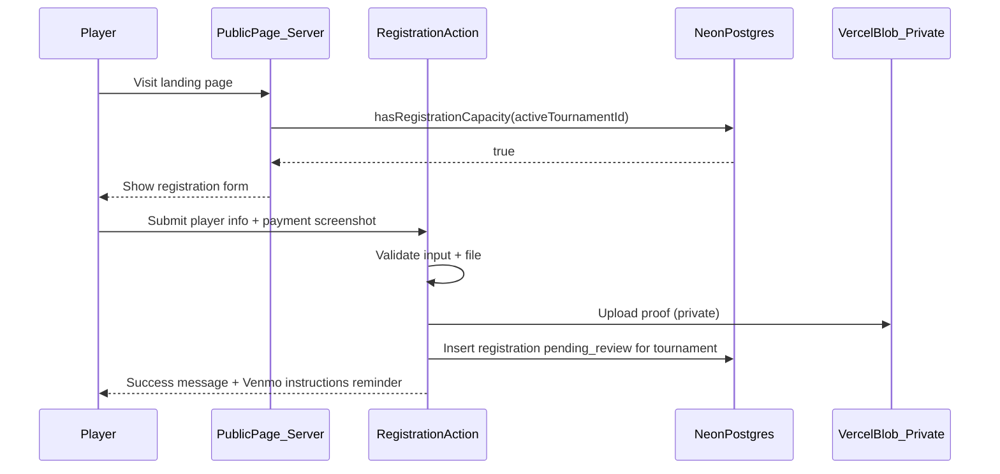
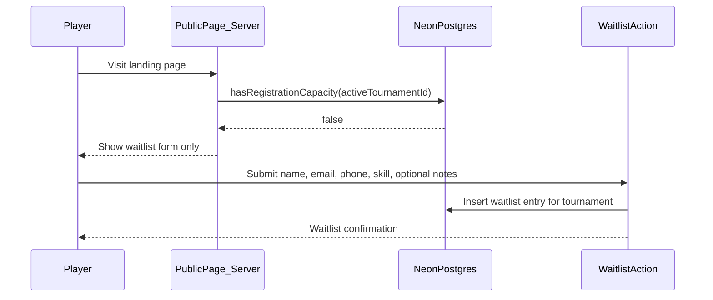
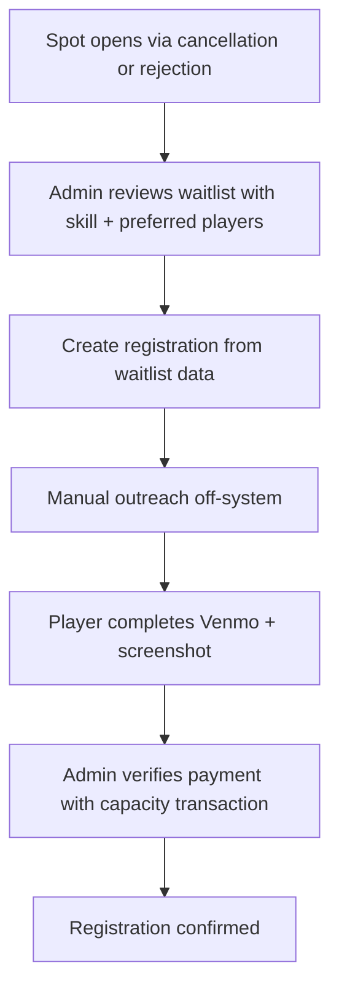

# Rusty Wedge Golf Scramble — Revised Planning Package

## Current Baseline

The repo is a **greenfield Next.js 16 scaffold** ([`app/page.tsx`](app/page.tsx), three starter home components). No database, auth, or domain logic exists yet. Architecture standards are enforced via [`.cursor/rules/rules.mdc`](.cursor/rules/rules.mdc) and [eslint.config.mjs](eslint.config.mjs): thin Server Component pages, small client islands, business logic in `lib/` services, files under 200 lines.

The [docs/first-pr-example.md](docs/first-pr-example.md) pattern (server page → client form leaf → `lib/actions/*`) is the template for all interactive features.

**Approved visual assets** (content direction, not pixel-perfect spec):
- Landing page mockup: `assets/RustyWedgeGolfScramble__1_-0d1f20f6-91a6-4a74-9015-03dcceb1605b.png`
- Invitation flyer: `assets/GolfScrambleInvitation__1_-0f0f3581-2204-429f-a82e-eaa36517f347.png`

---

## 0. Mockup & Invitation Review (Pre-Implementation Gate)

**Step 0 — COMPLETE.** Organizer decisions recorded below. Update `@RustyWedge` placeholder Venmo handle before production launch.

### Confirmed Organizer Decisions

| Decision | Confirmed Value |
|----------|-----------------|
| Event source | **Invitation flyer** |
| Event name | **The Rusty Wedge Golf Scramble** |
| Year | **2026** |
| Date | **Friday, August 28, 2026** |
| Tee time | **9:00 AM** |
| Location | **Deer Park Golf Course** |
| Entry fee | **$85** (8500 cents) |
| Payment methods | **Venmo only** (no Zelle in V1) |
| Venmo handle | **`@RustyWedge` placeholder** — update before launch |
| Public contacts | **Scott Wenzel Jr.** (509-218-4650), **Rusty Williams** (509-995-0269) |
| Capacity at verify fail | **Keep `pending_review`** — show admin error; admin decides manually (no auto-waitlist) |
| Waitlist name fields | **First Name + Last Name** (match registration form) |
| Admin allowlist seed | **None** — add admins manually after Neon Auth sign-up |
| Active tournament seed slug | `2026-rusty-wedge` |

Compare mockup + invitation against product requirements for **visual direction only**; do not treat mockup as pixel-perfect.

### Mockup-Aligned Scope (Landing Page)

| Section | Mockup Content | Plan Decision |
|---------|----------------|---------------|
| Header/Nav | Logo, About, Registration, Teams, FAQ, Register CTA | Nav anchors on `/`; **no public Teams page in V1** — "Teams" links to format section explaining organizer-assigned teams |
| Hero | Logo, title, tagline, date/time/location, CTAs | Use **active tournament record** for date/time/location (not hardcoded) |
| Info grid | Date, time, location, format, cost, includes | Pull from active `tournaments` row |
| Format | 4-person best ball scramble breakdown | Include skill-balancing note |
| Trophy | Rusty Wedge trophy photo + copy | Static content + trophy image asset |
| Mission/Values | Fun, Connection, Community cards | **Add to V1 scope** (present in mockup, absent from original bullet list) |
| Registration | Two-column: pricing summary + player form | Capacity-gated: registration form OR waitlist form |
| FAQ/Contact | Organizer cards with email buttons | **Scott Wenzel Jr.** & **Rusty Williams** with phone + email/tel links |
| Footer | Logo, social links, copyright | Include in V1 |

### Resolved Content Discrepancies

| Item | Resolution |
|------|------------|
| Event date/time/location | Invitation values → `tournaments` seed row (Aug 28, 2026, 9:00 AM, Deer Park) |
| Event name | **The Rusty Wedge Golf Scramble** (not "Bro-Am" in public title) |
| Payment methods | Venmo only; omit mockup Zelle toggle |
| Contacts | Invitation contacts with phone numbers |
| Venmo handle | Placeholder `@RustyWedge` until organizer confirms final handle |
| Capacity messaging | Generic "limited spots" OK; **never** numeric counts publicly |
| Skill levels | A/B/C/D enum with friendly UI labels |
| Registration type | Individual only — no team self-registration in V1 |

### Requirements Gaps Identified from Mockup

- **Mission/values section** — add to landing page scope
- **FAQ section** — add to landing page scope (can start with registration/payment/team assignment FAQs)
- **Preferred players disclaimer** — mockup shows notes field; include disclaimer text from requirements
- **Waitlist form** — mockup shows registration form only; waitlist form mirrors registration fields minus payment (see Section 1)

### Capacity Rule Confirmation (Non-Negotiable)

- Public site **never** displays 68, spots remaining, registration counts, or progress bars
- Capacity is internal only (`tournaments.confirmed_capacity_limit`)
- Admin dashboard **may** display counts
- Capacity based on **`confirmed` registrations only**
- **`pending_review` does not count**
- Capacity enforcement at **admin payment verification time**, not form submission time
- Generic "limited spots" marketing copy is allowed; numeric capacity is not

---

## 1. Product Requirements Summary

### Purpose
Annual 4-person best-ball scramble tournament. Players register individually; organizers manually build balanced teams after registration closes. V1 operates on **one active tournament**; schema supports multiple tournaments for reuse next year.

### Public Site (Unauthenticated)
| Section | Content |
|---------|---------|
| Hero | Tournament branding, CTA to register (from active tournament) |
| Tournament Details | Date, location, entry fee, includes |
| Trophy | Rusty Wedge trophy imagery |
| Format | 4-person scramble, organizer-assigned teams, skill-based balancing |
| Mission/Values | Fun, connection, community (per mockup) |
| Registration | **Capacity-gated registration form** OR **waitlist form** |
| FAQ | Registration, payment, team assignment |
| Contact | Organizer contact info |

### Registration (Per Player)
**Required:** first name, last name, email, phone, skill level (A/B/C/D)  
**Optional:** notes, preferred players (non-guaranteed; disclaimer required)  
**Payment:** Venmo ($85) + screenshot upload (JPG/PNG/PDF)  
**Outcome:** `pending_review` until admin verifies payment; **not complete until verified**

### Capacity Rules (Critical — Internal Only)
- **Max confirmed players: 68** — stored on active `tournaments` row, never shown publicly
- **Only `confirmed` registrations count** toward capacity
- **`pending_review` does not count** (payment unverified)
- **Public UI:** boolean gate only — registration form OR waitlist form
- **Never show:** player counts, spots remaining, "68", progress bars, registration counters
- **Admin dashboard:** full counts and breakdowns privately
- **Race at capacity:** decided at **admin payment verification time**, not form submission time

### Waitlist (When Confirmed = Capacity Limit)
**Required:** first name, last name, email, phone, skill level (A/B/C/D)  
**Optional:** preferred players, notes  
**No payment** at waitlist stage — payment collected after admin promotion  

**Rationale:** When promoted, organizers already have skill level and preferred-player data for balanced team creation without re-collecting it. First/last name matches registration form — no name-splitting on promote.

### Admin (Neon Auth — Organizers Only)
View/search/filter registrations, review payment screenshots, verify/reject payments, **admin review notes**, manage waitlist (with full player profile fields), promote players, create teams (max 4 players), assign/remove players, **view assignment reporting** (confirmed/assigned/unassigned), export CSV

### V1 Notifications (Manual Only — No Automation)

**V1 does not send automatic email or SMS notifications.**

Organizers manually contact players off-system for:
- Waitlist promotion and payment instructions
- Rejected payment screenshots (with reason)
- Registration issues or follow-up questions
- Team announcements after assignment

**Future enhancement:** Automated email/SMS for confirmation, rejection, waitlist, promotion, and team assignment.

### Team Management (V1)
Admin-created teams only. No auto-balancing algorithm. Max 4 players per team. Only `confirmed` players assignable.

### Admin Notes (Admin-Only, Not Public)
- **`payment_review_notes`** — issues during payment review (wrong amount, unclear screenshot, duplicate submission)
- **`admin_notes`** — general registration management notes (manual contact, special handling, **cancellation/refund reasons**)

**Cancellation / refund documentation:** When admin cancels a registration, **`admin_notes` must capture the reason** (required on cancel action in V1). Common examples:
- Refund handled
- Duplicate registration
- Player withdrew
- Payment never received (stale entry)

Cancel action sets `registration_status = cancelled` and records `registration_cancelled` audit event with note snapshot in metadata.

## 2. User Flows

### Flow A — Successful Registration (Capacity Available)



### Flow B — Registration at Capacity (Public)



### Flow C — Admin Payment Verification (Capacity Decision Point)

```mermaid
sequenceDiagram
  participant Admin
  participant AdminUI as AdminDashboard
  participant VerifyAction as VerifyPaymentAction
  participant DB as NeonPostgres

  Admin->>AdminUI: Open pending registration
  Admin->>VerifyAction: Approve payment
  VerifyAction->>DB: BEGIN TRANSACTION
  VerifyAction->>DB: COUNT confirmed FOR UPDATE scoped to tournament
  alt confirmed_count less than capacity_limit
    VerifyAction->>DB: SET confirmed + payment verified
    VerifyAction->>DB: COMMIT
    VerifyAction-->>Admin: Confirmed
  else at capacity
    VerifyAction->>DB: ROLLBACK status change
    VerifyAction->>DB: COMMIT
    VerifyAction-->>Admin: Error — at capacity; registration stays pending_review
  end
```

**At-capacity verify behavior (confirmed):** Verification **fails** with a clear admin message. Registration remains `pending_review` with payment still `submitted`. Admin uses `payment_review_notes` / `admin_notes` and manually decides (reject, waitlist, or retry after cancellation).

### Flow D — Admin Promotes Waitlist Player



**Promotion pre-fill:** When creating registration from waitlist, copy `first_name`, `last_name`, email, phone, skill_level, preferred_players, notes directly. Admin can edit before save.

### Flow E — Team Assignment

Admin creates team → selects up to 4 confirmed players → views skill levels + preferred-player notes → saves assignment. Removing a player updates `team_members` only; registration status unchanged.

---

## 3. Database Schema Design

**ORM:** Drizzle ORM + `@neondatabase/serverless`

### Table Justifications

| Table | Why It Exists |
|-------|---------------|
| `tournaments` | Annual event container — date, location, capacity, fees, active flag; avoids hardcoding year-specific values |
| `registrations` | Core player registration + status lifecycle, scoped to tournament |
| `waitlist_entries` | Queue when capacity full; carries skill/preferred-player data for future promotion |
| `teams` | Admin-created scramble teams, scoped to tournament |
| `team_members` | Player→team assignment; source of truth for assignment reporting |
| `admin_users` | Maps Neon Auth user IDs to admin role (global, not per-tournament in V1) |
| `registration_events` | Audit trail for verify/reject/promote/cancel |

**Removed:** standalone `tournament_settings` singleton — settings live on `tournaments`.

### Enum Types

```sql
skill_level: 'A' | 'B' | 'C' | 'D'
registration_status: 'pending_review' | 'confirmed' | 'waitlisted' | 'cancelled'
payment_status: 'not_submitted' | 'submitted' | 'verified' | 'rejected'
waitlist_status: 'active' | 'promoted' | 'removed'
```

### Schema (Detailed)

**`tournaments`**
- `id` UUID PK
- `name` TEXT NOT NULL (e.g. "The Rusty Wedge Golf Scramble 2026")
- `slug` TEXT UNIQUE NOT NULL (e.g. `2026-rusty-wedge`)
- `year` INT NOT NULL
- `event_date` DATE NOT NULL
- `tee_time` TIME NULL
- `location_name` TEXT NOT NULL
- `entry_fee_cents` INT NOT NULL DEFAULT 8500
- `confirmed_capacity_limit` INT NOT NULL DEFAULT 68
- `venmo_handle` TEXT NOT NULL
- `registration_enabled` BOOLEAN DEFAULT true
- `is_active` BOOLEAN DEFAULT false (exactly one active in V1)
- `created_at`, `updated_at` TIMESTAMPTZ

**V1 convention:** `getActiveTournament()` returns the single row where `is_active = true`. Future: route by slug or admin tournament selector.

**`registrations`**
- `id` UUID PK
- `tournament_id` UUID FK → tournaments NOT NULL
- `first_name`, `last_name` TEXT NOT NULL
- `email` TEXT NOT NULL (normalized lowercase)
- `phone` TEXT NOT NULL
- `skill_level` skill_level NOT NULL
- `notes` TEXT NULL
- `preferred_players` TEXT NULL
- `registration_status` registration_status NOT NULL DEFAULT 'pending_review'
- `payment_status` payment_status NOT NULL DEFAULT 'not_submitted'
- `payment_proof_path` TEXT NULL
- `payment_proof_content_type` TEXT NULL
- `payment_submitted_at` TIMESTAMPTZ NULL
- `payment_review_notes` TEXT NULL — admin-only, payment-specific issues
- `admin_notes` TEXT NULL — admin-only, general management notes
- `verified_at` TIMESTAMPTZ NULL
- `verified_by_admin_id` UUID FK → admin_users NULL
- `rejected_at` TIMESTAMPTZ NULL
- `rejection_reason` TEXT NULL (player-visible on reject action if needed later)
- `source_waitlist_entry_id` UUID FK → waitlist_entries NULL
- `created_at`, `updated_at` TIMESTAMPTZ

**Indexes/constraints:**
- UNIQUE partial on `(tournament_id, lower(email))` WHERE `registration_status` IN ('pending_review', 'confirmed')
- Index on `(tournament_id, registration_status, created_at)`
- Index on `(tournament_id, payment_status)`

**`waitlist_entries`**
- `id` UUID PK
- `tournament_id` UUID FK → tournaments NOT NULL
- `first_name`, `last_name` TEXT NOT NULL
- `email` TEXT NOT NULL
- `phone` TEXT NOT NULL
- `skill_level` skill_level NOT NULL
- `preferred_players` TEXT NULL
- `notes` TEXT NULL
- `status` waitlist_status DEFAULT 'active'
- `promoted_registration_id` UUID FK → registrations NULL
- `created_at`, `updated_at` TIMESTAMPTZ

**Constraints:**
- UNIQUE partial on `(tournament_id, lower(email))` WHERE `status = 'active'`

**`teams`**
- `id` UUID PK
- `tournament_id` UUID FK → tournaments NOT NULL
- `name` TEXT NOT NULL
- `created_at`, `updated_at` TIMESTAMPTZ

**`team_members`**
- `id` UUID PK
- `team_id` UUID FK → teams ON DELETE CASCADE
- `registration_id` UUID FK → registrations UNIQUE (one team per player)
- `assigned_at` TIMESTAMPTZ
- `assigned_by_admin_id` UUID FK → admin_users

**`admin_users`**
- `id` UUID PK
- `neon_auth_user_id` TEXT UNIQUE NOT NULL
- `email` TEXT NOT NULL
- `display_name` TEXT NULL
- `created_at` TIMESTAMPTZ

**`registration_events`** (audit log — all admin mutations)
- `id` UUID PK
- `tournament_id` UUID FK → tournaments NOT NULL
- `registration_id` UUID FK NULL
- `waitlist_entry_id` UUID FK NULL
- `team_id` UUID FK NULL
- `event_type` TEXT NOT NULL — see **Audit Event Catalog** below
- `admin_user_id` UUID FK NULL
- `metadata` JSONB NULL (before/after snapshots, rejection reason, blob path, etc.)
- `created_at` TIMESTAMPTZ

### Audit Event Catalog (Required in V1)

Every admin mutation below must call a shared `recordAuditEvent()` service. No silent admin state changes.

| Admin action | `event_type` | Primary FK | Metadata examples |
|--------------|--------------|------------|-------------------|
| Verify payment | `payment_verified` | `registration_id` | prior status, confirmed count at verify time |
| Reject payment | `payment_rejected` | `registration_id` | `rejection_reason` |
| Cancel registration | `registration_cancelled` | `registration_id` | prior status |
| Promote waitlist entry | `waitlist_promoted` | `waitlist_entry_id` | `promoted_registration_id` when created |
| Create team | `team_created` | `team_id` | `team_name` |
| Assign player to team | `player_assigned_to_team` | `registration_id`, `team_id` | player name, team name |
| Remove player from team | `player_removed_from_team` | `registration_id`, `team_id` | player name, team name |
| Update admin notes | `admin_notes_updated` | `registration_id` | fields changed (`payment_review_notes`, `admin_notes`) |
| Verify blocked at capacity | `verify_blocked_capacity` | `registration_id` | confirmed count at attempt time |

**Note:** `verify_blocked_capacity` is optional but recommended when capacity check fails at verify time.

### Capacity Query (Internal, Tournament-Scoped)

```sql
SELECT COUNT(*)
FROM registrations
WHERE tournament_id = $1
  AND registration_status = 'confirmed';
```

Public pages call a service returning `{ hasCapacity: boolean }` only — never the count.

### Verification Transaction (Pseudologic)

Inside a DB transaction scoped to `tournament_id`:
1. Lock tournament row (`SELECT ... FOR UPDATE`)
2. Count confirmed registrations for that tournament
3. Compare against `tournaments.confirmed_capacity_limit`
4. If under limit → `registration_status = confirmed`, `payment_status = verified`
5. Else → **abort verify**; no status change; return capacity error to admin; optional audit event `verify_blocked_capacity`

---

## 4. Route Structure

### Public Routes (No Auth)

| Route | Type | Responsibility |
|-------|------|----------------|
| [`/`](app/page.tsx) | Server Component | Landing page from active tournament + capacity-gated forms |
| `/api/auth/[...path]` | Route Handler | Neon Auth proxy (admin auth only in V1) |

Registration and waitlist are **sections on `/`** (anchor `#register`). Server decides which form to render. No public API exposes counts.

### Admin Routes (Neon Auth + Admin Allowlist)

| Route | Type | Responsibility |
|-------|------|----------------|
| `/auth/sign-in` | Server/Client | Neon Auth sign-in |
| `/admin` | Server | Dashboard: capacity counts, assignment summary, queues |
| `/admin/registrations` | Server | Searchable/filterable list |
| `/admin/registrations/[id]` | Server | Detail, payment proof, admin notes, verify/reject |
| `/admin/waitlist` | Server | Waitlist with skill/preferred players; promote/remove |
| `/admin/teams` | Server | Team list + **assignment reporting panel** |
| `/admin/teams/[id]` | Server | Team detail + player assignment |
| `/api/admin/payment-proofs/[registrationId]` | Route Handler | Authenticated private blob stream |

### Server Actions (in `lib/actions/`)

**Public:**
- `submitRegistration(formData)` — scoped to active tournament
- `submitWaitlist(formData)` — full waitlist field set

**Admin:**
- `verifyRegistrationPayment(registrationId)`
- `rejectRegistrationPayment(registrationId, reason)`
- `updateRegistrationNotes(registrationId, { paymentReviewNotes?, adminNotes? })`
- `cancelRegistration(registrationId, adminNotes)` — **admin_notes required**; documents cancellation/refund reason
- `promoteWaitlistEntry(waitlistId)` — pre-fills registration from waitlist data
- `createTeam(name)`, `assignPlayerToTeam(...)`, `removePlayerFromTeam(...)`
- `exportRegistrationsCsv()` — scoped to active tournament
- `exportTeamsCsv()` — team roster export for event-day backup and post-event archive

### Proposed Directory Layout

```text
app/
  page.tsx
  layout.tsx
  auth/sign-in/page.tsx
  admin/
    layout.tsx
    page.tsx
    registrations/page.tsx
    registrations/[id]/page.tsx
    waitlist/page.tsx
    teams/page.tsx
    teams/[id]/page.tsx
  api/
    auth/[...path]/route.ts
    admin/payment-proofs/[registrationId]/route.ts
components/
  marketing/
  registration/
  waitlist/
  admin/
lib/
  db/
  auth/
  services/
    tournament.ts          # getActiveTournament(), tournament scoping
    capacity.ts
    rate-limit.ts
    registration.ts
    waitlist.ts
    teams.ts
    team-assignment-report.ts
  actions/
  validation/
proxy.ts
```

---

## 5. Authorization & Security Model

### Public Access
- No authentication; no count endpoints; boolean capacity gate only
- **Public privacy rule:** public pages must never expose registration counts, capacity number, waitlist count, registered player names, admin notes, payment status, or payment proof URLs (see Section 5.1)

### Admin Access (Two-Layer)
1. Neon Auth session — **one account per organizer; no shared admin credentials**
2. `admin_users` allowlist check in every admin service/action
3. `proxy.ts` protects `/admin/*`

### Admin Account Policy
- Each organizer (Scott, Rusty, etc.) uses their **own Neon Auth account**
- Access granted only by row in `admin_users` linked to `neon_auth_user_id`
- Do not share passwords or a single admin login
- Document onboarding: sign up → organizer adds allowlist row manually

### Payment Proof Access
- Vercel Blob private store; admin authenticated route only
- Full hardening checklist in Section 5.1

---

## 5.1 V1 Security Hardening

### 1. Basic Rate Limiting

**Goal:** Reduce spam and prevent abuse of Blob uploads.

| Action | Scope | Suggested V1 limit |
|--------|-------|-------------------|
| Registration submit | IP + active tournament | 5 requests / IP / hour |
| Waitlist submit | IP + active tournament | 5 requests / IP / hour |
| File upload (registration) | Same as registration action | Counted with registration submit |

**Implementation:** `lib/services/rate-limit.ts` — IP from request headers (`x-forwarded-for` / `x-real-ip`), sliding or fixed window. Store counters in memory for V1 (acceptable for single-instance) or Neon table if multi-instance deploy. Return generic “too many requests” error; do not reveal limit details.

**Apply in:** `submitRegistration`, `submitWaitlist` server actions before validation/upload.

**Future enhancement:** CAPTCHA, distributed rate-limit store (Redis/Upstash).

---

### 2. Input Length Limits

Enforce in Zod schemas (client `maxLength` mirrors server). Suggested V1 max lengths:

| Field | Max chars |
|-------|-----------|
| First name | 50 |
| Last name | 50 |
| Email | 254 |
| Phone | 20 |
| Preferred players | 500 |
| Notes (player) | 1,000 |
| Admin notes | 2,000 |
| Payment review notes | 2,000 |
| Rejection reason | 500 |
| Team name | 100 |

Reject over-limit input with validation error before DB write.

---

### 3. Admin Proof Viewer Hardening

Route: `/api/admin/payment-proofs/[registrationId]`

**Must verify (in order):**
1. Authenticated Neon Auth session
2. Caller in `admin_users` allowlist
3. Registration exists for `registrationId`
4. Registration belongs to **active tournament**
5. Registration has non-null `payment_proof_path`
6. Blob fetched **only** via stored `payment_proof_path` — **never** accept arbitrary path from URL/query/body

**Forbidden:** Path traversal, cross-registration access, cross-tournament access, unauthenticated blob proxy.

**Response headers:** `Cache-Control: no-store`, `X-Robots-Tag: noindex`.

---

### 4. CSV Export Safety

**Spreadsheet formula injection:** Before writing CSV cells, escape values starting with `=`, `+`, `-`, `@`, or tab `\t` by prefixing `'` or wrapping per RFC-safe CSV practice (e.g. prefix `'` for Excel).

**Apply in:** `exportRegistrationsCsv()` service — all string columns including names, email, phone, notes.

**Test:** Vitest unit test with malicious `=CMD()` cell input.

---

### 5. PII-Safe Logging

**Do not log:**
- Phone numbers
- Email addresses
- Notes / preferred players text
- Admin notes / payment review notes
- Payment screenshot contents or binary data
- Raw uploaded file data

**May log:**
- `registration_id`, `waitlist_entry_id`, `team_id`, `tournament_id`
- Generic error codes / error names
- Blob **pathname** only (orphaned blob cleanup — no file contents)

**Apply in:** Server Actions, services, proof viewer route, rate-limit denials. ESLint `no-console` already restricts to warn/error — use structured error messages without PII.

---

### 6. Security Headers

Configure in `next.config.ts` headers and/or route-level overrides:

| Header / meta | Scope | Purpose |
|---------------|-------|---------|
| `X-Robots-Tag: noindex, nofollow` | `/admin/*`, proof viewer API | Prevent search indexing of admin |
| `Referrer-Policy: strict-origin-when-cross-origin` | Global | Reasonable referrer leakage control |
| `X-Frame-Options: DENY` or `frame-ancestors 'none'` | Global / admin | Clickjacking protection |
| `Content-Security-Policy` | Global (baseline) | Restrict script/style sources if feasible without breaking Neon Auth / Vercel Blob; start minimal in V1 |
| `Cache-Control: no-store` | Admin pages, proof viewer responses | No public caching of sensitive admin data |

Document any CSP exceptions required for Neon Auth UI.

---

### 7. Admin Account Policy

(See Section 5 — repeated for hardening checklist completeness.)
- Individual Neon Auth accounts per organizer
- Allowlist-controlled access only
- No shared credentials

---

### 8. Public Privacy Rule

Public routes (`/`, public Server Actions) must **never** expose:

| Forbidden on public surface |
|----------------------------|
| Registration counts |
| Capacity number (e.g. 68) |
| Waitlist count |
| Registered player names |
| Admin notes / payment review notes |
| Payment status |
| Payment proof URLs or blob paths |

**Allowed publicly:** boolean registration open vs waitlist; generic “limited spots” copy; tournament marketing content; organizer **contact** info (names/phones from static content — not derived from registration DB).

Enforced by: server-only capacity check, private blob store, admin-only proof route, public-capacity regression tests (H3, H15).

---

## 6. File Upload Strategy

### Recommendation: Vercel Blob (Private Store)

| Aspect | Decision |
|--------|----------|
| Provider | Vercel Blob — native Vercel integration |
| Access | **Private** store — payment screenshots are sensitive |
| Upload path | Server Action receives `FormData` file → `put()` with `access: 'private'` |
| Max size | 5 MB |
| Allowed types | `image/jpeg`, `image/png`, `application/pdf` |
| Stored in DB | Blob `pathname` only (not full URL) |
| Retrieval | Admin authenticated route uses `@vercel/blob` `get(pathname)` |

### Upload Flow
1. Player selects file in registration form (client island)
2. `submitRegistration` Server Action validates file server-side
3. Upload to `payment-proofs/{tournamentId}/{randomSuffix}.{ext}`
4. Persist pathname + content type on registration row
5. Set `payment_status = submitted`, `registration_status = pending_review`

### Upload Failure: Orphaned Blob (V1 Handling)

**Edge case:** Blob upload succeeds but database insert fails.

**V1 behavior (minimal — do not overbuild):**
1. Catch DB failure after successful blob upload
2. **`console.error`** log the orphaned blob pathname + tournament context
3. Return a generic error to the player; do not expose internal paths
4. Do **not** implement automated blob cleanup, retry queues, or compensating transactions in V1

**Future enhancement:** Scheduled job or admin tool to list/delete orphaned blobs by prefix + age.

### Additional Validation Cases (see Testing Plan)
- Missing file → reject before DB write
- Invalid MIME → reject
- Oversized file → reject

### Rejection / Re-upload
If admin rejects payment, admin can reset `payment_status` to `not_submitted` from detail page with note in `payment_review_notes`. Organizer contacts player manually (no automated notification in V1).

---

## 7. Admin Workflow Design

### Dashboard (`/admin`)
Private metrics for **active tournament only**:
- Confirmed count / capacity limit (e.g. "62 / 68" — admin-only)
- Pending review count
- Waitlist count
- Payment rejected count
- **Assignment summary:** confirmed / assigned / unassigned (derived — see Section 7.1)
- Quick links to review queue and unassigned players

### Registration Review Queue
1. Default filter: `pending_review` + `payment_status = submitted`
2. Search/filter by name, email, skill, status
3. Detail page: player fields, preferred players, payment proof viewer
4. **Editable admin fields:** `payment_review_notes`, `admin_notes`
5. Actions: Verify | Reject (reason required) | **Cancel (admin_notes reason required)** — each records audit event

### Verify Payment (Capacity Gate)
Transactional check at verify time. If at capacity → **verification rejected**; registration stays `pending_review`; record `verify_blocked_capacity` audit event; admin decides next steps manually

### Waitlist Management
- List shows: name, email, phone, **skill level**, preferred players, notes, date
- Promote → creates registration pre-filled from waitlist; admin completes payment workflow
- Remove → `status = removed`

### Team Management
- Create team; assign up to 4 confirmed players
- Skill badges + preferred-player tooltips
- Assignment reporting panel on `/admin/teams`

### CSV Export
- **Registrations CSV** — name, email, phone, skill, status, payment status, team name, notes, preferred players, admin notes, timestamps
- **Teams CSV** — team name, player names, skill levels, assignment status (for event-day backup and post-event archive); admin-only export action `exportTeamsCsv()`

### 7.1 Team Assignment Reporting (Derived — Recommended)

**Recommendation: derive from `team_members`; do not add a stored `assignment_status` field.**

| Metric | Derivation |
|--------|------------|
| **Confirmed players** | `COUNT(*)` from `registrations` WHERE `tournament_id = X` AND `registration_status = 'confirmed'` |
| **Assigned players** | `COUNT(DISTINCT tm.registration_id)` from `team_members tm` JOIN `registrations r` ON `r.id = tm.registration_id` WHERE `r.tournament_id = X` AND `r.registration_status = 'confirmed'` |
| **Unassigned players** | Confirmed LEFT JOIN team_members WHERE `tm.id IS NULL` |

**Why derived, not stored:**
- Single source of truth — assignment state lives only in `team_members`
- No sync bugs when assigning/removing players
- Cheap to query at admin scale (~68 players)
- Admin dashboard and `/admin/teams` call `getTeamAssignmentReport(tournamentId)` service

**Admin UI surfaces:**
- Dashboard summary cards (3 counts)
- `/admin/teams` — filterable list of unassigned confirmed players for drag/select assignment
- Optional badge on registration list: "Assigned" / "Unassigned"

---

## 8. Edge Cases

| Scenario | Handling |
|----------|----------|
| 67 confirmed; two admins verify pending simultaneously | Transaction + tournament row lock; one confirms as 68th, second gets capacity error → stays `pending_review` |
| Duplicate email registration (same tournament) | Reject if active pending/confirmed exists |
| Duplicate waitlist email | Reject if active waitlist entry exists |
| Same email on waitlist + registration attempt | Block registration; admin promotes from waitlist |
| Waitlist missing skill on promote | Prevented by schema — skill required on waitlist |
| Capacity drops (cancellation) | Admin manually promotes; promotion uses waitlist skill/preferred data |
| Invalid/corrupt payment screenshot | Admin rejects; `payment_review_notes` documents issue |
| Missing payment screenshot on submit | Server action rejects; no DB row created |
| Invalid file type / oversized upload | Server action rejects before blob/DB write |
| Registration form shown then capacity hit before submit | Submit allowed as `pending_review`; verify enforces capacity |
| Non-confirmed player assigned to team | Service rejects |
| Fifth player on team | Service rejects |
| Blob upload succeeds but DB insert fails | Log orphaned blob path via `console.error`; return generic player error; **no automated cleanup in V1** — future enhancement |
| Logged-out user hits `/admin` | Redirect to sign-in |
| Authenticated non-allowlisted user hits `/admin` | 403 |
| Multiple tournaments in DB | V1 uses `is_active = true` only; inactive tournaments hidden from public |
| Public page scraped for counts or PII | No counts, player names, waitlist count, payment data in SSR/API; H3 + H15 tests |
| Rate limit exceeded on registration/waitlist | Generic error; no PII in response; optional log with IP hash or omit IP |
| Over-max-length input | Zod validation rejects before DB/blob write |
| CSV cell starts with `=`, `+`, `-`, `@` | Escaped on export; Vitest unit test |
| Proof viewer: wrong registrationId | 404 after auth + allowlist check |
| Proof viewer: registration in inactive tournament | 404 / forbidden |
| Proof viewer: arbitrary blob path in URL | Ignored — only DB `payment_proof_path` used |
| Log statement on registration error | Must not include email, phone, notes |
| Waitlist promotion after confirmed cancellation | Admin promotes; new registration inherits waitlist skill/notes |

---

### MVP (V1)
- Mockup-aligned landing page (hero through contact)
- Tournament-scoped data model with one active tournament
- Registration + Venmo + screenshot upload
- Capacity-gated registration vs waitlist (full waitlist fields including skill)
- Admin auth + allowlist
- Payment verify/reject with transactional capacity
- Admin review notes (`payment_review_notes`, `admin_notes`)
- Waitlist promote with data pre-fill
- Team management + derived assignment reporting
- CSV export
- Audit events for all admin mutations (see Audit Event Catalog)
- **V1 security hardening** — rate limiting, input max lengths, proof viewer checks, CSV formula escape, PII-safe logging, security headers
- **Manual organizer contact only** — no automated email/SMS
- Automated commit-time checks (Husky: lint, typecheck, Vitest)
- Pre-launch Playwright E2E + Axe accessibility scans
- Manual smoke testing + Vercel logs/errors for production monitoring

### Future Enhancements
- **Automated email/SMS notifications** (confirmation, rejection, waitlist, promotion, team assignment)
- Admin tournament selector / multi-year archive views
- Tokenized player re-upload page
- Automatic waitlist promotion
- Team balancing assistant
- Stripe/automated payment verification
- RLS policies
- CAPTCHA on public forms
- Player self-service cancellation
- Zelle payment support (if organizers request)
- Scheduled stale-pending cleanup
- **Orphaned blob cleanup job/tool**

---

## 10. Testing, Quality & Monitoring

Quality stack for V1. Do not generate test code during planning — implement during roadmap Steps 8 and 40–49.

### V1 Quality Stack

| Layer | Tool | Role in V1 |
|-------|------|------------|
| Unit tests | **Vitest** | Pure logic: validation schemas, capacity rules, assignment report derivation |
| Service / integration tests | **Vitest** | Domain services against test DB or mocked Drizzle |
| E2E workflow tests | **Playwright** | Full browser flows: registration, waitlist gate, admin auth, verify, teams |
| Accessibility checks | **Axe** (`@axe-core/playwright`) | Scan public landing + forms; run in pre-launch suite |
| Git hooks | **Husky** | Enforce commit-time checks before every commit |
| Production monitoring | **Vercel logs / errors** | Runtime errors and function logs; no third-party APM |
| Pre-launch smoke | **Manual** | Organizer walkthrough on staging/production after deploy |

### Explicitly Out of Scope for V1

| Tool | Decision |
|------|----------|
| **Sentry** | **Do not add.** Short-lived event app; Vercel logs/errors + manual admin reporting are sufficient. |
| **Lighthouse CI** | **Not a required gate.** No Lighthouse in CI or Husky hooks. |
| Lighthouse (manual) | **Optional** — run manually in Chrome DevTools before launch for a quick public landing page performance/a11y spot-check. Document findings; not blocking. |

---

### Commit-Time Checks (Husky)

**Trigger:** Husky `pre-commit` hook on every commit.

| Check | Command | Target time |
|-------|---------|-------------|
| Lint | `npm run lint` | Full codebase, architecture boundaries |
| Typecheck | `npm run typecheck` | Strict TypeScript |
| Unit tests | `npm run test:unit` | Vitest unit project |
| Fast integration tests | `npm run test:integration` | Vitest service/integration project (keep fast — mock DB or focused test DB) |

**Not in commit hook:** Playwright, Axe, Lighthouse, manual QA.

#### Recommended Package Scripts (Commit-Time)

```json
{
  "lint": "eslint",
  "typecheck": "tsc --noEmit",
  "test:unit": "vitest run --project unit",
  "test:integration": "vitest run --project integration",
  "test:vitest": "vitest run",
  "check": "npm run lint && npm run typecheck && npm run test:vitest",
  "pr": "node scripts/pr-gate.mjs",
  "prepare": "husky"
}
```

**Husky `pre-commit`:** runs `npm run check` (lint → typecheck → Vitest unit + integration).

**`scripts/pr-gate.mjs`:** same as `check` — lint, typecheck, Vitest (for CI/PR if added later).

---

### Pre-Launch / Heavier Checks

Run before production deploy. Document pass/fail in `docs/qa/prelaunch-checklist.md`.

| Check | Tool | Scope |
|-------|------|-------|
| E2E workflow tests | **Playwright** (`npm run test:e2e`) | Registration, waitlist gate, admin login, verify payment, team assign, CSV export |
| Accessibility scans | **Axe** (`npm run test:a11y`) | Landing page, registration form, waitlist form — WCAG violations fail pre-launch |
| Manual registration workflow | Human | Venmo instructions clarity, upload UX, success/error states |
| Manual admin workflow | Human | Proof review, verify/reject at capacity, waitlist promote, team building |
| Vercel deployment smoke test | Human + Playwright (optional against prod URL) | End-to-end on deployed environment |
| Lighthouse review | **Manual only (optional)** | Chrome DevTools Lighthouse on `/` — not blocking |

#### Recommended Package Scripts (Pre-Launch)

```json
{
  "test:e2e": "playwright test",
  "test:a11y": "playwright test --project a11y",
  "test:public-privacy": "vitest run tests/public-privacy",
  "qa:checklist": "node scripts/print-qa-checklist.mjs",
  "prelaunch": "npm run check && npm run test:e2e && npm run test:a11y && npm run qa:checklist"
}
```

- `prelaunch` — all commit-time checks + Playwright E2E + Axe + manual checklist reminder
- `qa:checklist` — prints remaining manual steps from `docs/qa/prelaunch-checklist.md`

---

### Production Monitoring (V1)

| Source | Use |
|--------|-----|
| **Vercel Function logs** | Server Action errors, orphaned blob pathname only — **no PII** |
| **Vercel error dashboard** | Unhandled exceptions, 5xx responses |
| **Manual admin reporting** | Organizers report issues via direct contact; tracked in `admin_notes` |

**No Sentry.** Revisit only if the app becomes long-lived or error volume exceeds Vercel visibility.

---

### High-Risk Automated Test Coverage (Required)

Every item below must have an automated test in V1. Primary tool noted.

| # | Requirement | Vitest | Playwright |
|---|-------------|--------|------------|
| H1 | `pending_review` registrations **do not** count toward capacity | ✓ capacity service integration | — |
| H2 | `confirmed` registrations **do** count toward capacity | ✓ capacity service integration | — |
| H3 | Public site never displays numeric capacity, spots remaining, or registration counters | ✓ public-capacity privacy suite | ✓ E2E assert `/` HTML has no forbidden patterns |
| H4 | Duplicate active email registration is blocked | ✓ registration service integration | ✓ E2E duplicate submit |
| H5 | Payment screenshot is required | ✓ registration action integration | ✓ E2E submit without file |
| H6 | Invalid upload file types are rejected | ✓ upload validation integration | — |
| H7 | Oversized uploads are rejected | ✓ upload validation integration | — |
| H8 | Only confirmed players can be assigned to teams | ✓ team service integration | ✓ E2E assign pending player fails |
| H9 | Teams cannot exceed 4 players | ✓ team service integration | ✓ E2E fifth assign fails |
| H10 | Waitlist form requires skill level | ✓ waitlist schema unit + action integration | ✓ E2E waitlist without skill |
| H11 | Waitlist promotion carries skill level and preferred-player notes forward | ✓ waitlist promote service integration | ✓ E2E admin promote flow |
| H12 | Unauthenticated users cannot access admin routes | — | ✓ E2E `/admin` redirect |
| H13 | Authenticated but non-allowlisted users cannot access admin routes | — | ✓ E2E 403 |
| H14 | Payment proof viewer is admin-only | ✓ route handler integration | ✓ E2E unauthenticated 401/403 |
| H15 | Public pages never expose waitlist count, player names, payment status, proof URLs | ✓ public-privacy suite | ✓ E2E `/` response inspection |
| H16 | Rate limit blocks excessive registration/waitlist submits | ✓ rate-limit service integration | — |
| H17 | Over-max-length inputs rejected | ✓ Zod schema unit tests | — |
| H18 | Proof viewer rejects wrong tournament / missing registration | ✓ route integration | ✓ Playwright |
| H19 | Proof viewer never accepts arbitrary blob path | ✓ route integration | — |
| H20 | CSV export escapes formula injection (`=`, `+`, `-`, `@`) | ✓ csv export unit test | — |
| H21 | Error logs omit email, phone, notes | ✓ logging integration / spy test | — |
| H22 | Admin routes return noindex / no-store cache headers | ✓ header integration test | — |

**Public privacy (H3 + H15) — Vitest / Playwright assertions:**
- No literal `68`, `spots remaining`, `spots left`, `players registered`, `registration count`, waitlist count
- No registered player names from DB on public pages
- No payment status, admin notes, or proof URLs in public HTML/JSON
- No progress bar / counter UI patterns
- `hasRegistrationCapacity()` boolean-only — never serializes count to client

**Admin routes may display capacity counts** — assert only on authenticated admin context.

---

### Supplementary Scenario Reference

| # | Scenario | When | Tool |
|---|----------|------|------|
| T1 | 67 confirmed; concurrent admin verify | Pre-launch manual | Manual |
| T2 | 68 confirmed; waitlist form shown | Pre-launch | Playwright + manual |
| T3 | Forged registration at capacity | Pre-launch | Vitest integration |
| T9 | Valid JPG/PNG/PDF upload | Pre-launch | Playwright E2E |
| T13 | Promote waitlist after cancellation | Pre-launch | Playwright E2E + manual |
| T23–T24 | Admin notes persist; not public | Pre-launch manual | Manual |
| T25 | Orphaned blob on DB fail | Commit-time | Vitest integration |
| T26 | Audit events on admin actions | Commit-time | Vitest integration |
| T27 | Rate limit triggers after threshold | Commit-time | Vitest integration |
| T28 | CSV formula injection escaped | Commit-time | Vitest unit |
| T29 | Proof viewer cross-registration access denied | Pre-launch | Vitest + Playwright |
| T30 | Public page contains no PII from registrations | Commit-time + pre-launch | Vitest H15 + Playwright |
| O1 | Organizer phone numbers approved for public display | Pre-launch | Manual sign-off |
| O2 | Payment screenshot upload from iPhone photo library | Pre-launch | Manual mobile QA |
| O3 | Payment screenshot upload from Android photo library | Pre-launch | Manual mobile QA |
| O4 | Payment screenshot upload from desktop file picker | Pre-launch | Manual desktop QA |
| O5 | Export registrations + teams day before tournament | Event-day ops | Manual |
| O6 | Re-export morning of tournament if changes occurred | Event-day ops | Manual |

### Test Environment Setup

- Seed active tournament with `confirmed_capacity_limit = 68`
- Vitest integration: test DB or mocked Drizzle
- Playwright: local dev server or staging URL; admin test user on allowlist
- Separate test tournament slug for destructive scenarios

---

## 12. Operational Checklists

Operational procedures are **manual** in V1 (no automated lifecycle jobs). Document in `docs/qa/prelaunch-checklist.md` and `docs/qa/post-event-checklist.md`.

### 12.1 Pre-Launch Checklist Additions

| # | Task | Owner | Pass criteria |
|---|------|-------|---------------|
| O1 | **Confirm public phone numbers** | Organizers | Scott Wenzel Jr. (509-218-4650) and Rusty Williams (509-995-0269) **explicitly approved** for display on website contact section and any invitation-linked materials |
| O2 | Venmo handle finalized (replace `@RustyWedge` placeholder) | Organizers | Correct handle on registration instructions |
| O3 | **Mobile payment upload QA** | Organizer/tester | Successful registration with screenshot from **iPhone photo library** |
| O4 | **Mobile payment upload QA** | Organizer/tester | Successful registration with screenshot from **Android photo library** |
| O5 | **Desktop payment upload QA** | Organizer/tester | Successful registration via **desktop file picker** (JPG/PNG/PDF) |
| O6 | Admin allowlist configured | Organizers | Each organizer has own Neon Auth account in `admin_users` |
| O7 | Run `npm run prelaunch` | Developer | Vitest + Playwright + Axe pass |

---

### 12.2 Event-Day Backup Export (Manual Operations)

Run from admin dashboard **before and during tournament week**:

| When | Action |
|------|--------|
| **Day before tournament** | Export **registrations CSV** and **teams CSV**; store securely offline (organizer device/cloud) |
| **Morning of tournament** | If any registrations, teams, or assignments changed overnight → **export both CSVs again** |
| **After final team lock** | Keep final teams CSV as authoritative roster for check-in |

No automated scheduled exports in V1 — organizer-initiated only.

---

### 12.3 Post-Tournament Shutdown & Retention

Run after event concludes. Checklist in `docs/qa/post-event-checklist.md`:

| # | Task | Notes |
|---|------|-------|
| P1 | Export **final registrations CSV** | Archive for records |
| P2 | Export **final teams CSV** | Archive for records |
| P3 | **Decide payment screenshot retention** | Organizers confirm whether Venmo proofs are still needed for disputes/refunds |
| P4 | **Delete payment proof uploads** if no longer needed | Remove blobs from Vercel Blob; clear or null `payment_proof_path` on registrations (manual admin process or scripted one-off in V1) |
| P5 | **Disable registration** | Set `tournaments.registration_enabled = false` for active tournament (manual DB update in V1; optional admin UI toggle post-MVP) |
| P6 | **Close public site (optional)** | Replace landing with “registration closed” message, or take deployment offline per organizer preference |
| P7 | Document retention decision | Note in organizer records what was kept/deleted and when |

**Future enhancement:** Admin “end tournament” action automating P4–P6 with confirmation prompts.

---

## 11. Detailed Implementation Plan (49 Sequential Steps)

### Phase 0 — Pre-Implementation (Step 0)
0. **Mockup & invitation review** — **COMPLETE.** Organizer decisions recorded in Section 0. Remaining pre-launch item: replace `@RustyWedge` placeholder with final Venmo handle.

### Phase 1 — Foundation (Steps 1–8)
1. **Add dependencies** — `@neondatabase/serverless`, `drizzle-orm`, `drizzle-kit`, `@neondatabase/auth`, `@vercel/blob`, `zod`, `vitest`, `@playwright/test`, `@axe-core/playwright`, `husky`; DB scripts
2. **Environment setup** — `.env.example` with all required vars; Vercel sync doc
3. **Database client** — [`lib/db/index.ts`](lib/db/index.ts)
4. **Drizzle schema** — all tables including `tournaments`, `waitlist_entries`, admin notes, expanded `registration_events` audit FKs
5. **Initial migration** — apply schema
6. **Seed active tournament** — `2026-rusty-wedge`: name "The Rusty Wedge Golf Scramble", year 2026, date 2026-08-28, tee 09:00, Deer Park Golf Course, capacity 68, fee 8500, venmo `@RustyWedge` (placeholder), `is_active = true`
7. **Document admin onboarding** — README/docs: sign up via Neon Auth, then manually insert row into `admin_users`
8. **Quality + operational docs** — Vitest/Husky harness; `docs/qa/prelaunch-checklist.md` (includes O1–O7); `docs/qa/post-event-checklist.md` (P1–P7); `scripts/print-qa-checklist.mjs`

### Phase 2 — Auth, Admin Shell & Security Headers (Steps 9–13)
9. **Neon Auth server setup** — `lib/auth/server.ts`, `lib/auth/client.ts`, API route
10. **Auth middleware** — `proxy.ts` for `/admin/*`
11. **Admin authorization service** — `requireAdminSession()`, allowlist check; document one-account-per-organizer policy
12. **Admin layout** — nav: dashboard, registrations, waitlist, teams; admin `noindex` metadata
13. **Security headers** — `next.config.ts`: referrer policy, frame protection, baseline CSP; `Cache-Control: no-store` on admin + proof route

### Phase 3 — Domain Services (Steps 14–20)
14. **Tournament service** — `getActiveTournament()`, tournament scoping helper
15. **Validation schemas** — registration, waitlist, admin notes, admin actions; **max length limits** per Section 5.1
16. **Rate limiting service** — IP/window counters for registration + waitlist (`lib/services/rate-limit.ts`)
17. **Audit event service** — `recordAuditEvent()` + Audit Event Catalog constants
18. **Capacity service** — `hasRegistrationCapacity()`, `getConfirmedCount()` (admin-only), `confirmRegistrationIfCapacity()`
19. **Registration service** — CRUD, duplicate checks, status transitions, admin notes, audit; **PII-safe error messages**
20. **Waitlist + team + CSV services** — promote, team assign/remove, `getTeamAssignmentReport()`, **`escapeCsvCell()` formula injection helper**

### Phase 4 — Public Site (Steps 21–28)
21. **Landing page structure** — server page composing mockup-aligned sections
22. **Marketing components** — hero, info grid, trophy, format, mission/values, FAQ, contact
23. **Registration section shell** — capacity boolean gate; no counts or PII in markup
24. **Registration form client island** — fields with client `maxLength`; skill select, payment upload, disclaimer
25. **Registration server action** — **rate limit check** → validate → blob → insert; orphaned blob pathname log only; PII-safe errors
26. **Waitlist form client island** — first/last name, email, phone, skill, optional preferred players/notes
27. **Waitlist server action** — **rate limit check** → validate → insert
28. **Public UX** — success/error states; confirm H3 + H15 privacy (no counts, names, payment data)

### Phase 5 — File Storage (Steps 29–30)
29. **Blob upload helper** — MIME/size validation, private paths scoped by tournament (no user-controlled path segments)
30. **Admin proof viewer route** — full Section 5.1 checklist: session, allowlist, registration exists, active tournament, DB path only, no-store headers

### Phase 6 — Admin Registration Management (Steps 31–35)
31. **Admin dashboard** — private counts, assignment summary
32. **Registrations list** — search, filters, assigned/unassigned badge
33. **Registration detail** — proof viewer, verify/reject, admin notes editors
34. **Verify/reject/cancel actions** — transactional capacity; audit events; **cancel requires `admin_notes` reason** (refund, duplicate, withdrew, etc.)
35. **Update notes action** — persist notes + `admin_notes_updated` audit event

### Phase 7 — Waitlist, Teams & Export (Steps 36–39)
36. **Waitlist admin page** — promote/remove + audit on promote
37. **Teams page** — create team + audit; unassigned panel; assignment report
38. **Team detail** — assign/remove + audit; max-4 enforcement
39. **CSV export** — registrations CSV + **teams CSV** (`exportTeamsCsv`); formula injection escape on all string cells

### Phase 8 — Automated Tests (Steps 40–43)
38. **Vitest high-risk + security** — H1–H11, H14–H22, T25–T28
41. **Public privacy tests** — Vitest `tests/public-privacy/` (H3 + H15); Husky hook
42. **Playwright E2E** — H3–H5, H8–H13, H18, H29: registration, waitlist, admin auth, proof viewer, promote
43. **Axe accessibility scans** — landing, registration, waitlist forms

### Phase 9 — Pre-Launch QA & Deploy (Steps 44–49)
44. **Manual pre-launch QA** — registration + admin workflows; **O1 phone number sign-off**; **O3–O5 mobile/desktop upload tests**; document in prelaunch checklist
45. **Optional Lighthouse review** — manual DevTools on `/`; not blocking
46. **Edge case hardening** — fix Vitest, Playwright, Axe, manual QA failures
47. **Security review pass** — headers, rate limits, proof route, CSV export, PII-safe logs
48. **Vercel deployment** — env sync; smoke test; monitor Vercel logs/errors; run `npm run prelaunch`
49. **Hand off event-day + post-event ops docs** — confirm organizers have `docs/qa/post-event-checklist.md`; walk through O5/O6 event-day exports and P1–P7 shutdown steps

---

## Validation Requirements Summary

- **Registration:** required fields, skill enum, valid email/phone, file required + type/size check; **max lengths** per Section 5.1; **rate limit** before processing
- **Waitlist:** first/last name, email, phone, skill required; preferred players + notes optional; max lengths; duplicate active email blocked; **rate limit**
- **Admin verify:** session + allowlist; must be `pending_review` with submitted payment; capacity at verify time
- **Admin reject:** reason required; max 500 chars
- **Admin cancel:** `admin_notes` required documenting reason (refund handled, duplicate, withdrew, etc.)
- **Admin notes:** admin-only; max 2,000 chars each (`payment_review_notes`, `admin_notes`)
- **Team name:** max 100 chars
- **Team assign:** confirmed only, team < 4, not already assigned
- **Capacity:** tournament-scoped; confirmed only; enforced in `confirmRegistrationIfCapacity()` only
- **Public privacy:** no counts, capacity number, waitlist count, player names, admin notes, payment status, or proof URLs on public routes
- **Proof viewer:** session + allowlist + registration in active tournament + DB path only
- **CSV export:** formula injection escape on all string cells
- **Logging:** PII-safe per Section 5.1 — no email, phone, notes, or file contents in logs
- **Audit:** every admin mutation in Audit Event Catalog must call `recordAuditEvent()`
- **Notifications:** V1 manual only; no automated email/SMS

---

## Key Architecture Decisions

| Decision | Choice | Rationale |
|----------|--------|-----------|
| Tournament scoping | `tournaments` table + FKs | Annual reuse without hardcoding year |
| V1 tournament selection | Single `is_active` row | Simple; multi-select later |
| Waitlist fields | Match registration profile minus payment | Promotion needs skill/preferred data |
| Admin notes | Two TEXT fields on registrations | Separate payment vs general concerns |
| Assignment reporting | Derived from `team_members` | No duplicate state; always accurate |
| ORM | Drizzle | Type-safe, Neon-documented |
| File storage | Vercel Blob private | Fits Vercel deploy; sensitive proofs |
| Capacity enforcement | DB transaction at verify | Required; not at form submit |
| Public counts | Never exposed | Required |
| Commit-time checks | Husky → lint + typecheck + Vitest | Fast feedback every commit |
| Pre-launch checks | Playwright E2E + Axe + manual QA | Heavier; before deploy only |
| Production monitoring | Vercel logs/errors only | No Sentry in V1 |
| Performance audit | Manual Lighthouse (optional) | Not in CI or required gates |
| Notifications | Manual organizer contact | No email/SMS automation in V1 |
| Rate limiting | IP/window on public submits | Reduce spam and blob abuse |
| Input limits | Zod max lengths | Prevent oversized payloads |
| CSV export | Formula injection escape | Safe admin spreadsheet open |
| Logging | PII-safe only | Short-lived app; Vercel logs sufficient |
| Security headers | noindex admin, no-store sensitive routes | Reduce exposure surface |
| Admin accounts | One Neon Auth user per organizer | No shared credentials |

---

## Success Criteria for V1 Launch

- Step 0 organizer decisions applied; Venmo handle updated from placeholder before production launch
- Active tournament drives all public content and scoping
- Player registers with payment when capacity available; no public counts shown
- Waitlist form collects skill + optional preferred players/notes when at capacity
- Admin verifies with transactional capacity; concurrent verify handled correctly
- Admin notes persist; not visible publicly
- Assignment report shows correct confirmed/assigned/unassigned counts
- All admin mutations create audit events per Audit Event Catalog
- All high-risk + security automated tests (H1–H22) pass in Vitest and/or Playwright
- Rate limiting active on registration and waitlist actions
- Proof viewer passes full authorization checklist; no arbitrary blob paths
- CSV export escapes formula injection
- Logs contain no PII (email, phone, notes, file data)
- Security headers configured; admin routes not indexed; sensitive responses not cached
- Cancelled registrations document reason in `admin_notes` (refund, duplicate, withdrew)
- Organizer phone numbers signed off for public display (O1)
- Mobile + desktop payment upload QA complete (O3–O5)
- Event-day backup export procedure documented (O5–O6)
- Post-event shutdown checklist delivered to organizers (P1–P7)
- Husky commit-time checks pass (`npm run check`)
- Pre-launch suite passes (`npm run prelaunch`: Vitest + Playwright + Axe + checklist)
- Public capacity privacy tests pass (H3) — no numeric capacity on public routes
- Manual registration and admin workflows documented in QA checklist
- Vercel deployment smoke test complete; production errors monitored via Vercel dashboard
- No Sentry; optional manual Lighthouse review only
- V1 uses manual organizer contact only (no automated notifications)
- Venmo handle updated from placeholder before production launch
